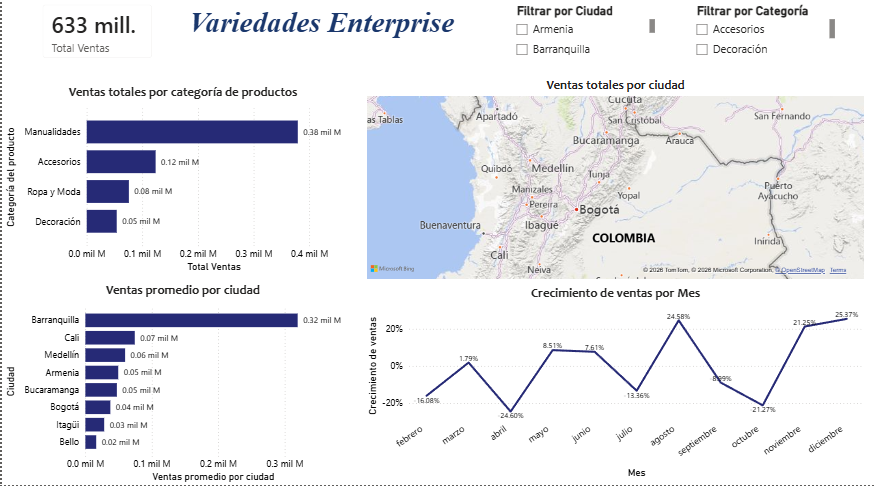

# 📊 Dashboard de Ventas — Variedades Enterprise
**Diplomado en Power BI para el Análisis y la Visualización de Datos**



---

## 📋 Descripción del proyecto

Dashboard interactivo de ventas construido en **Power BI Desktop** para la empresa ficticia *Variedades Enterprise*, una cadena de tiendas con presencia en 8 ciudades de Colombia. El proyecto cubre el ciclo completo de análisis de datos: desde la carga y limpieza de datos hasta el modelado, cálculo de métricas con DAX y diseño del tablero final.

---

## 🗂️ Estructura del repositorio

```
variedades-enterprise-powerbi/
│
├── README.md                          # Este archivo
├── dashboard_final.png                # Captura del dashboard terminado
│
├── data/
│   └── BASES_DE_DATOS_VARIEDADES_ENTERPRISE.xlsx   # Fuente de datos original (4 tablas)
│
└── report/
    └── Variedades_Enterprise.pbix                  # Archivo Power BI Desktop
```

---

## 📁 Fuente de datos

El archivo Excel contiene 4 tablas que conforman el modelo de datos:

| Tabla | Descripción | Filas |
|---|---|---|
| `Ventas` | Transacciones de venta (tabla de hechos) | 7,243 |
| `Productos` | Catálogo de productos con precio | 189 |
| `Tiendas` | Tiendas por ciudad | 8 |
| `Ciudades` | Ciudades de operación en Colombia | 8 |

---

## 🔧 Proceso de transformación (Power Query)

Los datos requirieron limpieza antes de poder modelarse:

- **Filas vacías:** eliminación de 5 filas completamente nulas al final de la tabla `Ventas`.
- **Columna Fecha:** las fechas llegaron como texto en español (`"Enero 1 2022"`). Se dividió la columna por espacio, se convirtió el nombre del mes a número mediante una tabla de equivalencias en M, y se reconstruyó la fecha con `#date(año, mes, día)`.
- **Tipos de dato:** verificación y corrección de tipos en todas las columnas (IDs como texto, cantidades y precios como número decimal).
- **Columna calculada:** `Total_Venta = Cantidad × Precio Unitario`, creada en Power Query.
- **Geocodificación:** creación de columna `Ciudad_Mapa` concatenando `, Colombia` al nombre de ciudad para evitar ambigüedad en el mapa de Bing.
- **Nombres de categoría:** reemplazo de códigos (`Man_C56`, `Acc_C56`, `Dec_C56`, `Rop_C56`) por nombres legibles (`Manualidades`, `Accesorios`, `Decoración`, `Ropa y Moda`).

---

## 🧩 Modelo de datos

Esquema en estrella con `Ventas` como tabla de hechos central:

```
Ciudades ──(1:*)── Tiendas ──(1:*)── Ventas ──(*:1)── Productos
```

| Relación | Cardinalidad |
|---|---|
| `Productos[ID_PRODUCTO]` → `Ventas[ID_PRODUCTO]` | Uno a muchos |
| `Tiendas[ID_Tienda]` → `Ventas[ID_Tienda]` | Uno a muchos |
| `Ciudades[ID_Ciudad]` → `Tiendas[ID_CIUDAD]` | Uno a muchos |

---

## 📐 Medidas DAX

```dax
-- Total de ventas
Total Ventas = SUM(Ventas[Total_Venta])

-- Promedio de ventas por ciudad
Ventas promedio por ciudad =
    AVERAGEX(VALUES(Tiendas[ID_CIUDAD]), [Total Ventas])

-- Crecimiento porcentual mes a mes
Crecimiento de ventas =
VAR __PREV_MONTH = CALCULATE([Total Ventas], DATEADD('Ventas'[Fecha_Final], -1, MONTH))
RETURN
    DIVIDE([Total Ventas] - __PREV_MONTH, __PREV_MONTH)
```

---

## 📈 Visualizaciones del dashboard

| Visual | Campo(s) | Medida |
|---|---|---|
| 🃏 Tarjeta KPI | — | Total Ventas |
| 📊 Barras horizontales | Categoría del producto | Total Ventas |
| 📊 Barras horizontales | Ciudad | Ventas promedio por ciudad |
| 🗺️ Mapa | Ciudad_Mapa | Total Ventas (tamaño burbuja) |
| 📉 Gráfico de líneas | Fecha (nivel Mes) | Crecimiento de ventas |

**Interactividad:** dos segmentadores de datos (filtro por Ciudad y filtro por Categoría) que filtran todas las visualizaciones de forma cruzada.

---

## 🔍 Principales hallazgos

- **Total de ventas:** $633 millones COP en el periodo analizado (2022).
- **Categoría líder:** Manualidades concentra el 60% de las ventas totales ($380M), muy por encima de Accesorios ($120M), Ropa y Moda ($80M) y Decoración ($50M).
- **Ciudad líder:** Barranquilla tiene el mayor promedio de ventas por tienda ($320M), más de 4 veces por encima de Bello ($20M), la ciudad con menor desempeño.
- **Estacionalidad marcada:** caídas pronunciadas en abril (-24%) y octubre (-21%), con recuperación fuerte en agosto (+24%) y cierre de año destacado en noviembre (+21%) y diciembre (+25%).

---

## 👤 Autor

~ Angela Murillo — Proyecto desarrollado como actividad del **Diplomado en Power BI para el Análisis y la Visualización de Datos**.
